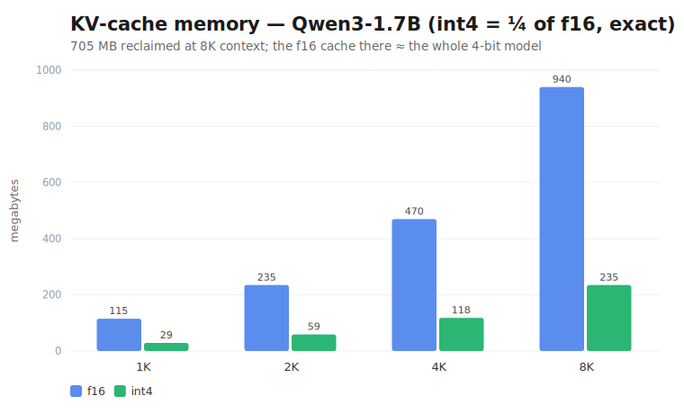
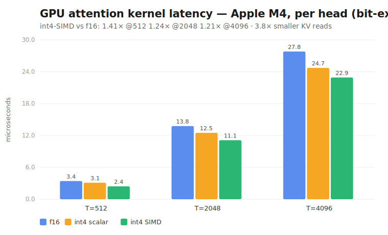
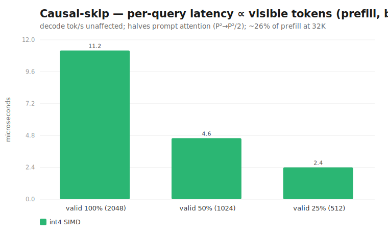

# Heads-up / RFC: int4 + Hadamard KV-cache quantization for tract (CPU + Metal)

@kali — opening this **as a heads-up before I split it into reviewable PRs**, in the same spirit as
#2321: it's a sizeable body of work, it sits right next to your KV-cache + SDPA areas, and I'd value
your read on the **shape** (and one genuine architectural open question on the Metal side) before any
of it goes merge-bound. Everything below is **opt-in and additive — byte-identical when off**.

---

## TL;DR

A training-free, opt-in **int4 KV-cache** for the transformers decode path: per-token int4 in a
fixed-Hadamard basis with an integer-domain score dot, plus causal masking and an exact-f32
sink/recent window. It is **validated bit-exact against a CPU reference and produces token-identical
generation to f16 on Qwen3-1.7B**. A Metal kernel for it is ported into `tract-metal`, GPU-validated
bit-exact on an M4, and benchmarked.

**Be clear-eyed on the value (measured, not hoped):** the win is **memory**, not throughput.

---

## Benefits (measured)

| Dimension | Result | How measured |
|---|---|---|
| **KV-cache memory** | **4× smaller** (int4 vs f16) — exact | Qwen3-1.7B: 112 KB/token → 28 KB; 940 MB → 235 MB at 8K context |
| **Quality** | **token-for-token identical to f16** | Qwen3-1.7B, 24 greedy tokens, identical text + identical top-5 |
| **CPU decode speed** | **≈ f16 (parity)** | persistent-state decode on Qwen3-1.7B CPU: 18.8 vs 18.8 tok/s |
| **GPU attention kernel** | bit-exact on M4; **SIMD 1.2–1.4×** vs an f16 baseline kernel; 3.8× smaller reads | standalone Metal harness, T=512/2048/4096 |
| **Causal-skip (prefill)** | bit-exact; attention work ∝ visible tokens (≈2× on the triangle) | latency 11.2µs→4.6µs→2.4µs as `valid` halves |



**Honest framing for the PR:** decode of a small model is weight-bandwidth-bound, so the 4× smaller
cache barely moves *generation* tok/s on CPU (it reaches parity, not a speedup); the GPU kernel gives
a modest 1.2–1.4×. The reason to want this is **fitting longer context in unified memory** (4× cache),
quality-neutral, not a throughput bump. I'd state that plainly in the PR so nobody is misled.

---

## What's done (inventory)

**CPU (`tract-transformers`)**
- `QuantKvInt4`: per-token int4 K/V in a fixed-Hadamard basis (FWHT, O(D log D)); symmetric
  zero-point-free quant; integer score dot `int8(Q)·int4(K)→i32`; exact-f32 sink/recent window.
- `QuantizedKvSdpa`: stateful fused op (cache + attention), `OpState` + freeze/unfreeze, causal
  masking, NNEF ser/de (`axis`, `scale`, `causal`, `n_recent`).
- `fuse_quantized_kv_sdpa`: opt-in `ModelTransform` that rewrites `{DynKeyValueCache, DynKeyValueCache,
  Sdpa}` → the fused op (strips the GQA broadcast chain first, reusing the existing rule).
- ~15 unit tests incl. **bit-identical** quant/pack, FWHT == dense Hadamard, causal masking, NNEF
  round-trip, and full-attention vs f32 reference.

**Metal (`tract-metal`)**
- `nn/kv_int4.metal` (scalar + SIMD variants) registered as `LibraryName::KvInt4`.
- `dispatch_attend` through `MetalStream`/`DeviceTensor`; on-device test diffs vs the CPU reference
  (full + causal) — passes on M4.

**Validation / tooling (dev-only, not proposed for the tree)**
- Swift GPU harness (bit-exact + benchmark), Python research harnesses, a test-case dumper, and a
  real-model probe + persistent-state decode driver in `causal_llm`.

**Independent, generically-useful bycatch**
- `CausalLlmState::{kv_cache_bytes, kv_cache_dt, kv_seq_len}` accessors + a `bench_decode` tool.

---

## Architecture

### Data flow (decode)

```
token ─► model ─► (per layer) K_new, V_new ─┐
                                            ▼
                       QuantizedKvSdpa (stateful, one per attention layer)
                       ├─ append: rotate(FWHT) → per-token symmetric int4 → pack          (or keep in f32 recent window)
                       ├─ score : int8(Q_rot)·int4(K_rot) → i32, ×scales                  (causal: only t ≤ limit)
                       ├─ softmax
                       ├─ P·V over int4 V (+ exact f32 over recent window)
                       └─ un-rotate (FWHT) ─► attention output
```

State = one `QuantKvInt4` per `(batch × kv_head)`: packed int4 K/V (⌈D/2⌉ bytes/token) + one f32
scale/token + the f32 recent window. Decode appends one token/step; prefill appends the chunk then
attends each position with its causal limit.

### Why this quant scheme

- **KIVI layout** (per-channel K, per-token V) is the training-free baseline; it handles outlier
  channels but caps near 4 bits and the per-channel running scale goes stale on a growing cache.
- **Fixed Hadamard (FWHT)** spreads outlier-channel energy so a **per-token** shared scale survives
  int4 — which is the layout that makes the **integer dot** well-posed (scale outside the reduction).
  Q and K rotate by the same orthonormal H, so `(QH)(KH)ᵀ = QKᵀ` — scores are unchanged by
  construction; the rotation only ever helps quantization. (Measured on real GPT-2: a fixed Hadamard
  is a modest int4 win on deeper layers; uniform int2 is not viable without the mixed-precision
  window — hence `n_recent`.)

### Causality & mixed precision

- **Causal masking** is plumbed from `Sdpa::is_causal` through the fuse rule. It only affects
  multi-token prefill chunks (decode is single-query). It's *exact* — masked entries contribute zero
  by the model's definition, so causal-skip is bit-identical to compute-then-mask, just cheaper.
- **`n_recent`** keeps the newest tokens in exact f32 (the OSCAR/StreamingLLM sink/recent idea); 0 =
  pure int4. This is the lever for pushing the body below 4 bits later.

### NNEF surface

`tract_transformers_quantized_kv_sdpa(q, k, v) { axis, scale, causal, n_recent }` — all optional with
back-compat defaults; freeze/unfreeze checkpoints the running cache.

### Metal integration — and the open question

The attention kernel is a first-class `tract-metal` kernel (compiles + pipelines + dispatches through
`DeviceTensor`, GPU-verified vs CPU). What is **not** done, and where I'd like your steer:

- The op is **stateful** — the int4 cache must live in **GPU-resident** `DeviceTensor` buffers that
  grow across decode steps. I haven't found the idiom for **stateful ops on the Metal backend**
  (`OpState`-on-Metal): does the GPU runtime persist op state across `run` calls the way the CPU
  `SimpleState` does, or is the expected pattern to keep the cache as model I/O (like `unfold-kv-cache`)
  and thread GPU buffers externally?
- On-device **append** needs a second small kernel (rotate + quantize + pack), not yet written —
  otherwise quant stays CPU-side and the bandwidth point is lost.

This is the one genuinely uncertain architectural decision; the rest is mechanical.

### Relationship to your in-flight work

- **#2321 (InPlaceKvSdpa)**: same neighbourhood — both fuse `cache → Sdpa` and own the K/V buffers.
  This is the *quantized* sibling; they could share the cache-management shape. Worth deciding whether
  they converge on one stateful-cache abstraction.
- **#2320 (Metal SDPA / MFA)**: the int4 kernel is an alternative attention path; the MFA kernel can't
  read a strided/quantized K, which is why this is an owned `.metal`.
- **#2348 (W4A8 int8-dot GEMV)**: the score dot is the same `int8·int4→i32` primitive — the on-device
  unpack/dot helper could be shared.

### Validation methodology

Bit-exact gates throughout (the integer dot is associative, so SIMD == scalar == CPU by construction);
FWHT proven equal to the dense Hadamard; the alloc-free quant/pack proven byte-identical to the naive
path; and the end-to-end check is **token-identical generation vs f16 on a real Qwen3-1.7B** (the fuse
fires on the real post-RoPE/GQA graph, collapsing 57 unfolded KV I/Os into one stateful op).

---

## Prior art & references

This is an **engineering synthesis of established, mostly training-free techniques** — not new
research. Where each design decision comes from:

| Design choice | Prior art (verified) |
|---|---|
| Asymmetric KV quant — **per-channel K, per-token V**, tuning-free, low-bit | **KIVI** — Liu et al., ICML 2024 — [arXiv:2402.02750](https://arxiv.org/abs/2402.02750) |
| **Orthonormal rotation removes outliers** → 4-bit; *online Hadamard on K/V to quantize the KV cache* — our most direct precedent; Q·K invariant under a shared rotation | **QuaRot** — Ashkboos et al., NeurIPS 2024 — [arXiv:2404.00456](https://arxiv.org/abs/2404.00456); **SpinQuant** (learned rotations) — Liu et al., 2024 — [arXiv:2405.16406](https://arxiv.org/abs/2405.16406) |
| Rotation as the lever for the **KV cache specifically**; calibration-free random rotation + scalar quant | **TurboQuant** (random rotation + Lloyd–Max + 1-bit QJL) — Google Research & NYU, ICLR 2026 — [arXiv:2504.19874](https://arxiv.org/abs/2504.19874) |
| Calibrated (attention-aware) rotation for **INT2**; its finding *"Hadamard reduces outliers but degrades at INT2"* corroborates our measured "int4 fine, int2 needs more" | **OSCAR** — Together AI — [arXiv:2605.17757](https://arxiv.org/abs/2605.17757) |
| **O(D log D) butterfly** instead of a dense rotation matmul | Fast **Walsh–Hadamard transform** — Fino & Algazi, *IEEE Trans. Computers* C-25(11):1142–1146, 1976 — [doi:10.1109/TC.1976.1674569](https://doi.org/10.1109/TC.1976.1674569) |
| **Exact-f32 sink/recent window** (`n_recent`) as the lever for sub-4-bit | **StreamingLLM** (attention sinks) — Xiao et al., ICLR 2024 — [arXiv:2309.17453](https://arxiv.org/abs/2309.17453); OSCAR's BF16 sink/recent |
| Keep *all* tokens + quantize (vs eviction / cache management) — the trade we chose | **H2O** (heavy-hitter eviction) — Zhang et al., NeurIPS 2023 — [arXiv:2306.14048](https://arxiv.org/abs/2306.14048); **EpiCache** (episodic management) — Apple, 2025 — [arXiv:2509.17396](https://arxiv.org/abs/2509.17396) |
| **Online/streaming softmax**; causal block-skip | **FlashAttention** — Dao et al., NeurIPS 2022 — [arXiv:2205.14135](https://arxiv.org/abs/2205.14135) |
| **Integer-domain W4A8 score dot** (`int8·int4→i32`) | general W4A8 quant; tract #2348 (same unpack/dot primitive) |
| **Stateful in-place KV cache** (the op shape) | Apple Core ML `MLState`/`StateType`; llama.cpp `llama_memory_i`; candle-nn `kv_cache`; tract #2321 |
| RoPE-commutative codebook — a fancier, EM-trained follow-on we **did not** take | **CommVQ** — Li et al., ICML 2025 — [arXiv:2506.18879](https://arxiv.org/abs/2506.18879) |

The specific recipe here — **fixed Hadamard (QuaRot) applied to the KIVI per-token layout so the
shared-scale int4 survives, making the integer dot well-posed**, plus an exact recent window
(StreamingLLM) — is the **calibration-free intersection** of these: no per-model calibration pass
(unlike OSCAR), no learned rotation (unlike SpinQuant), no codebook training (unlike CommVQ). That's
the property that makes it a fit for a pure inference runtime. Our own measurement that a *fixed*
Hadamard rescues int4 but not int2 independently reproduces OSCAR's central finding.

This work was triggered by a survey of the recent KV-cache compression literature¹.

¹ "The KV Cache Compression Race: TurboQuant vs OSCAR vs EpiCache", marktechpost, 2026-06
(<https://www.marktechpost.com/2026/06/18/the-kv-cache-compression-race-turboquant-vs-oscar-vs-epicache/>).

## Proposed contribution slicing

**Independent (no dependency on this feature):**
1. `CausalLlmState` KV accessors + `bench_decode` tool.

**The feature (a stack rooted at the op):**
2. **int4 + Hadamard KV-quant op** (FWHT + `QuantKvInt4` + `QuantizedKvSdpa` + causal + NNEF +
   transform). *Optionally split int8-KIVI-first → int4+Hadamard → causal if you prefer smaller steps.*
3. mixed-precision `n_recent` window — stacks on (2).
4. Metal int4 kernel + dispatch + DeviceTensor test — stacks on (2).
5. real-model examples (`quant_probe`, `persistent_decode`) — stack on (2).
6. **stateful Metal op + rewrite + prefill dispatch** — stacks on (2)+(4); the open piece above.

---

## What I'd like from you

1. Is the **fused stateful op** (cache + attention in one `OpState`) the shape you want, or would you
   rather a core-level quantized-cache abstraction shared with #2321?
2. The **`OpState`-on-Metal** question above — what's the intended pattern for a stateful GPU op?
3. Any objection to the **NNEF surface** / the opt-in transform approach?
4. Preference on **slicing granularity** (one op PR vs int8→int4→causal→window steps).

Happy to redirect on any of these before splitting it into PRs.

---

## Appendix: Measured performance data

**Platform:** Apple **M4** (8 GPU cores, Metal 4), macOS. **Model:** Qwen3-1.7B `q40ef16` NNEF
(28 layers, 16 query / 8 KV heads, head-dim 128). All "bit-exact" below means rel-dev ≤ 1e-6 vs the
CPU reference (the integer score dot is associative, so SIMD == scalar == CPU by construction).

### 1. KV-cache memory — the headline (exact)

Measured 114 688 B/token f16 (= 28·2·8·128·2). int4 = ¼ (packed nibbles + one f32 scale/token):

| context | KV f16 | KV int4 | reclaimed |
|---|---|---|---|
| 1 K  | 115 MB | 29 MB  | 86 MB |
| 2 K  | 235 MB | 59 MB  | 176 MB |
| 4 K  | 470 MB | 118 MB | 352 MB |
| 8 K  | 940 MB | 235 MB | 705 MB |

At 8 K the f16 cache (940 MB) is ~the size of the entire 4-bit model; int4 reclaims **705 MB**.

### 2. Generation quality (Qwen3-1.7B, end-to-end)

- Single forward, prompt "The capital of France is": int4 and f16 give the **same argmax** (`" Paris"`)
  and the **identical top-5** `[" Paris", " a", " in", " the", " located"]`.
- 24-token greedy decode: **token-for-token identical** to f16 —
  `" Paris. The capital of the United States is Washington, D.C. The capital of Canada is Ottawa. …"`.
- The `fuse_quantized_kv_sdpa` transform fires on the real post-RoPE/GQA graph, collapsing **57**
  unfolded KV I/Os (28·2 + token) into **1** stateful op.

### 3. CPU incremental decode (persistent state, Qwen3-1.7B, M4 CPU)

True one-token-per-step decode (the op accumulates its cache via `SimpleState`):

| | tok/s |
|---|---|
| f16  | 18.8 |
| int4 | 18.8 |

**Parity** — and that's the honest ceiling: CPU decode of a 1.7B model is **weight-bandwidth-bound**
(~1 GB of weights read/token dominates), so the 4× smaller KV cache reaches parity, not a speedup.
The motivating f16 baseline (separate `bench_decode`) shows why memory still matters: decode collapses
**50.8 → 12.7 tok/s** from ctx 6 → 2053, fit `step_ms = 20.4 + 0.0272·ctx` — at 2 K context **73 % of
per-token time is KV-cache reading**, so the cache is the scaling bottleneck even though it isn't the
*absolute* one at short context.

### 4. GPU attention kernel (M4, standalone harness, per-head µs)

Bit-exact at every size; f16 baseline kernel vs int4 scalar vs int4 SIMD nibble-unpack:

| T | f16 | int4-scalar (vs f16) | int4-SIMD (vs f16) | SIMD vs scalar |
|---|---|---|---|---|
| 512  | 3.42 µs  | 3.11 µs (1.10×) | **2.43 µs (1.41×)** | 1.28× |
| 2048 | 13.77 µs | 12.50 µs (1.10×) | **11.12 µs (1.24×)** | 1.12× |
| 4096 | 27.81 µs | 24.72 µs (1.12×) | **22.91 µs (1.21×)** | 1.08× |



Memory per head: f16 256/1024/2048 KB → int4 68/272/544 KB (**3.8× smaller** at all sizes).
SIMD helps more at small T (compute-bound: the unpack dominates) than large T (memory-bound: the
unpack hides behind the load). **Caveat:** the bench is cache-resident (all threadgroups read one
buffer), which *understates* int4's DRAM-bandwidth advantage — a real multi-head decode would favour
int4 more.

### 5. Causal-skip (prefill, M4)

Bit-exact vs CPU `attend_limited`; per-query latency scales with the visible-token count `valid`:

| valid | µs/head |
|---|---|
| 2048 (100 %) | 11.2 |
| 1024 (50 %)  | 4.6  |
| 512 (25 %)   | 2.4  |



Summed over a prefill (query i sees i+1 tokens) this is the **P² → P²/2** halving of prompt-attention
compute. **Decode tok/s is unaffected** (single-query, no triangle); the benefit is time-to-first-token
on long prompts, and grows with prompt length (attention is O(P²), the rest O(P)): ~1 % at 512 →
~6 % at 4 K → ~26 % at 32 K of prefill.

### 6. CPU op-level microbench (`QuantKvInt4::attend` vs f32 streaming, D=128)

| T | int4 vs f32 streaming | memory vs f32 |
|---|---|---|
| 256  | **1.50×** | ~7.5× smaller |
| 1024 | 1.41× | 7.5× |
| 2048 | 1.13× | 7.5× |
| 4096 | 1.13× | 7.5× |

(The FWHT done as an O(D log D) butterfly, not a dense matmul, is what makes the small-T case a win
rather than a regression.)

### 7. Numerical accuracy (CPU, vs full-f32 attention)

- int4 + Hadamard on planted-outlier data: rel-dev **0.115** (int4 envelope).
- mixed-precision window: pure-int4 0.110 → 16 recent tokens 0.102 → full f32 window 0.000 (exact).

### Methodology notes

- **What each measures:** §3 is end-to-end model decode; §4/§6 are attention-kernel-only microbenches
  (no weight reads), so their ratios are larger than the model-level effect — at the model level the
  KV path is ~5–10 % of a weight-bound decode step.
- **Baselines:** §4 is vs **f16** (→ ~3.8× memory, the realistic deployed baseline); §6 is vs **f32**
  (→ ~7.5×). int4 is ¼ of f16 / ⅛ of f32 before per-token scale overhead.
- **Bit-exactness** is enforced by tests, not asserted: integer dot (associative), FWHT == dense H,
  alloc-free quant/pack == naive, and token-identical generation on the real model.

